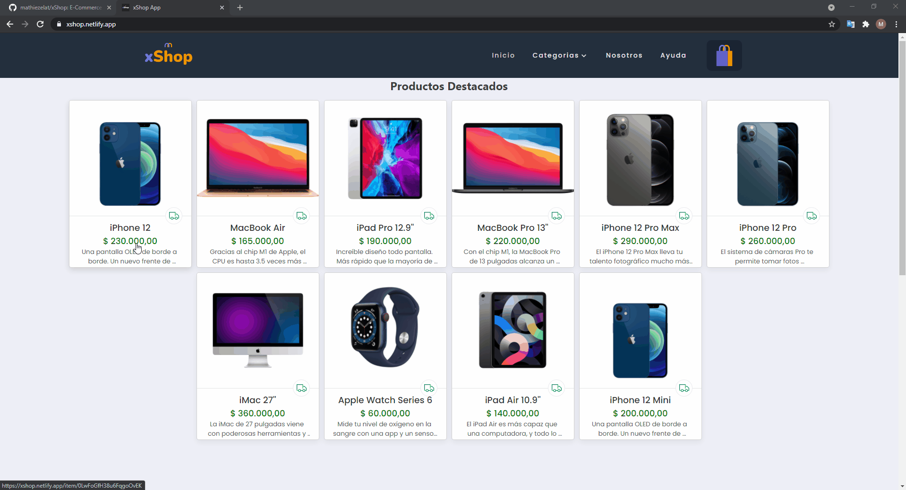

# xShop / Tienda Online 🚀

Es una página **e-commerce** inspirada en otras páginas del mismo estilo, mi idea como principal es una tienda online _simple_ y _fácil_ de navegar para los _usuarios_, que tiene como objetivo ser _rápida_ para que los _usuarios_ esperen lo minimo posible. :sparkles:

## Inicializar el proyecto 👨‍💻

- Para poder instalar las dependencias basta con un _npm i_
- Correr el proyecto en tu computadora seria con un _npm start_
- Hacer un build al proyecto para que quede optimizado usar _npm run build_

## Visita la página 💡

- Click [Acá](https://xshop.netlify.app/) para ir a la _página_.

## Vista previa de la página 🎬

## Construido con 🛠️

- **_ReactJS_** - _Libreria_ usada - _versión 17.0.1_
- **_Firebase_** - Base de datos para los productos y las ordenes - _versión 8.4.1_
- **_React dom router_** - Para hacer el ruteo de la página - _versión 5.2.0_
- **_SCSS_** - Para dar estilos - _versión 1.32.8_

## Autor ✒️

- **Mathías Ezequiel Latrónico** - _Creador de xShop_ - [mathiezelat](https://github.com/mathiezelat)

### Hecho con ❤️
